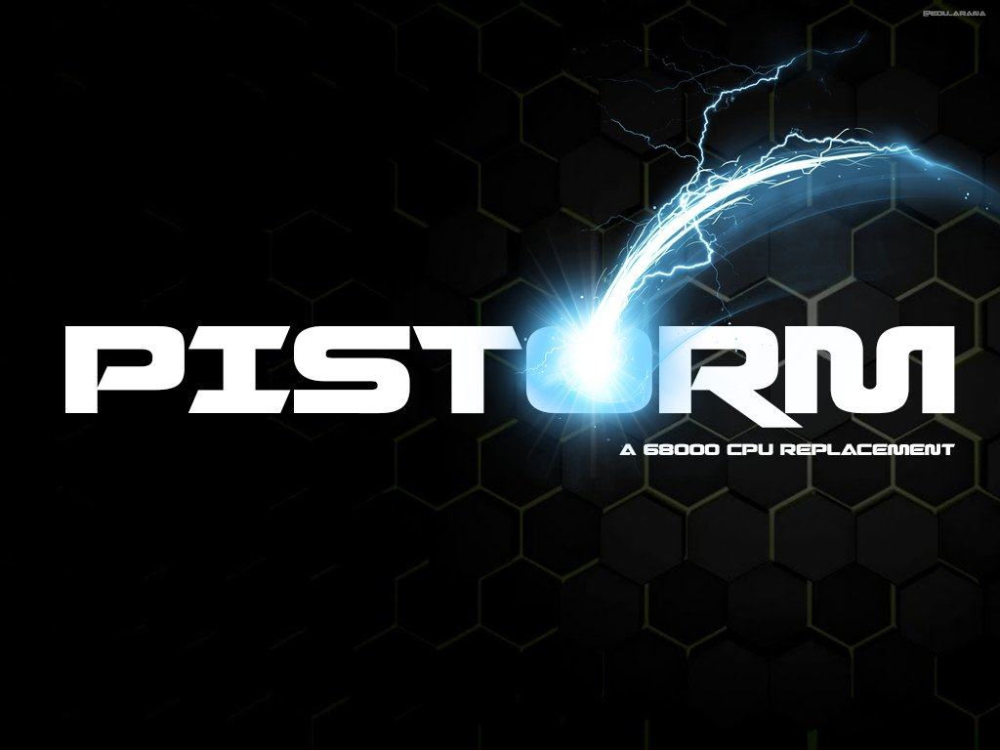

# PiStorm

## Join us on Discord or on Freenode IRC #PiStorm

* There's a Discord server dedicated to PiStorm discussion and development, which you can join through [this handy invite link](https://discord.com/invite/j6rPtzxaNW).
* There's also an IRC channel on the Freenode IRC network, `#PiStorm`, which is bridged with the `#general` channel on Discord.

## Project information

* The PiStorm itself is an adapter board intended to be paired with a Raspberry Pi Model 3A+. It goes in the DIP socket on and acts in place of the CPU, but functionality can be extended beyond simple CPU emulation.
* Hardware files are available in [PiStorm_RevB_EPM240_74LVC16373.zip](./hardware/PiStorm_RevB_EPM240_74LVC16373.zip), but they may be out of date. Joining the Discord and checking for the latest revision/BoM for the PiStorm adapter board is recommended.
* Selling blank PCBs or derivatives on eBay or similar for excessive profit is frowned upon and may lead to forthcoming related projects being closed source.
* This is not meant to discourage you from making PiStorm boards for others to enjoy, but for instance selling the product as a commercial item and then pawning off support to the community if something doesn't work is absolutely not good™.

* While the PiStorm should work with any DIP socket 16-bit 68000-powered system, the FC lines are currently not properly handled and no guarantees can be made for it working on anything except an Amiga 500, 500+ and 2000.
* General Performance with the current use of Musashi as the 68k CPU emulator is somewhere around a 70-80 MHz 68030.
* The intended Raspberry Pi model to use with the PiStorm is Model 3A+. 3B/3B+ works, but due to component clearance issues it will not fit unless the Pi itself is modified (USB ports replaced) or a GPIO spacer/relocator is installed.
* The Raspberry Pi Zero and Model 1B+/2/4 cannot currently be used with the PiStorm, and support for these is not officially planned yet.

## Amiga-specific functionality

Since much of the initial work and testing for the PiStorm was done on Amiga computers, a number of extended features are available when the PiStorm is paired with for instance an Amiga 500:
* Kickstart ROM mapping: 1.3, 2.0, 3.1, anything you might own and have dumped in a byteswapped format. Extended ROM mapping as well for instance with the CDTV extended BIOS.
  * An A1200 3.1+ Kickstart ROM is currently recommended, as this one has the most dynamic automatic configuration on boot.
* Fast RAM: Z2, Z3 and CPU local Fast can be mapped for high performance memory available to the CPU only on the PiStorm side of things.
* Virtual SCSI: PiSCSI, a high performance virtual SCSI interface for mapping raw RDB disk images or physical storage devices connected to the Pi for use on the Amiga.
* RTG: PiGFX, a virtual RTG board with almost all P96-supported functionality supported and acceleration.
* Some other things: Most likely I forgot something while writing this, but someone will probably tell me about it.

## Simple quickstart

* Download Raspberry Pi OS from [the Pi operating repository](https://www.raspberrypi.org/software/operating-systems/), the Lite version is recommended as the windowing system of the Full version adds a lot of extra system load which may impact performance.
* Write the Image to a SD Card. 8GB is plenty for the PiStorm binaries and required libraries, but if you wish to use large hard drive images or sometthing with it, go with a bigger card.
* Install the PiStorm adapter in place of the orignal CPU in the system, for instance an Amiga 500.
  Make sure the PiStorm sits flush and correct in the socket.
  When installed in an Amiga 500, The correct orientation on the PiStorm is with the USB port facing toward you and the HDMI port facing to the right.
  If the PiStorm does not stay in place properly (popping out of the CPU socket) then bend the pins of the PiStorm very very very slightly outwards.
  Double check that all is properly in place and no pins are bent.
* Connect an HDMI Display and a USB keyboard to the PiStorm. Using a USB Hub is possible, an externally powered hub is recommended.
  Connect the Amiga to the PSU and monitor
* Insert the SD into the Raspberry Pi, Power on the Amiga now. You should see a Rainbow colored screen on the HDMI Monitor and the PiStorm booting.

* When the boot process is finished (on the first run it reboots automatically after resizing the filesystems to your SD) you should be greeted with the login prompt.
* Log in as the default user, typically user: `pi` and password: `raspberry`. (The keyboard is set to en_GB Layout on first boot!)
* Run `sudo raspi-config`
* Set up your preferences like keyboard layout, language, etc. It is recommended to set the screen resolution to 1280x720.
* Set up your Wi-Fi credentials
* Enable SSH at boot time
* Exit `raspi-config`

You can now reach the PiStorm over SSH, check your router web/settings page to find the IP of the PiStorm, or run `ifconfig` locally on the PiStorm from the console.

Now the final steps to get things up and running, all of this is done from a command prompt (terminal) either locally on the PiStorm or over ssh:
* `sudo apt-get install git libsdl2-dev`
* `git clone https://github.com/captain-amygdala/pistorm.git`
* `cd pistorm`
* `(cd src && make)`

Next up, follow the steps for installing the FPGA bitstream update below. (Scroll down.)
You can now start the PiStorm emulator with a basic config by typing `sudo src/emulator` and hitting enter.

To exit the emulator you can press `Ctrl+C` (on the keyboard or over SSH) or press `Q` on the keyboard connected to the Raspberry Pi.

The Amiga Gayle IDE emulation can take both hard drive images generated using `makedisk` in the `ide` directory (these have a 1KB header) or headerless RDSK/RDB images created for instance in WinUAE or as empty files. The IDE emulation currently has a quirk that may require you to reduce/increase the size of the image file by 2MB in order for it to work.

Since PiSCSI can now autoboot RDSK hard drive images for Amiga computers, using the IDE controller emulation is not recommended unless you already have a suitable `.img` file set up for it.

## FPGA bitstream update

Install OpenOCD:
`sudo apt-get install openocd`

Make CPLD programming shell scripts executable:
`chmod +x cpld/nprog.sh` `chmod +x cpld/nprog_240.sh`

Run the FPGA update with:
`sudo cpld/nprog.sh` or `sudo cpld/nprog_240.sh` if you are using a Rev. B EPM240 PiStorm board.
If no fatal error messages are printed on screen and you see a message saying `shutdown command invoked`, this means that the CPLD has been programmed successfully.

## Layout

* `pistorm`
  * `buptest` 
    A tool for testing connectivity between the Pi & CPLD
  * `cpld` 
    Bitstream binaries and verilog source for CPLD firmware
  * `data` 
    Data generated by the `emulator` process; contains nvram, relocated ROM images, etc.
  * `doc` 
    Documentation (please write some documentation?)
  * `example` 
    Configuration examples
  * `hardware` 
    Schematics, gerbers, bill of materials, pick-and-place instructions for assembly
  * `src` 
    Emulator source code

## License

PiStorm is Copyright (c) 2021 PiStorm developers, released under the MIT license. The full license text can be obtained from [the license text in the root of the source code](./LICENSE).
